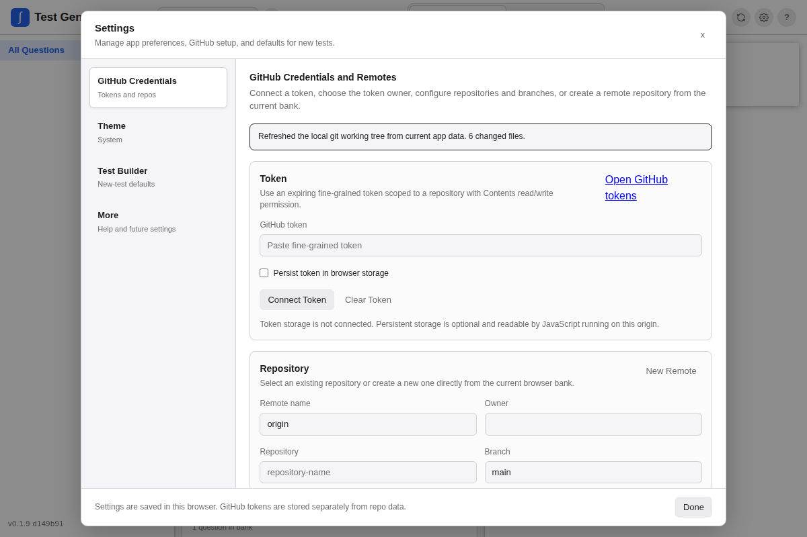

The Gradebook tab is an experimental roster and score-entry area for tests built in the app. Enable it under **Settings -> More -> Gradebook (experimental)**.

Gradebook course sections are rostered groups of students such as “Period 2 AP Calc”. They are separate from curriculum classes in the question bank.

## Course Sections and Rosters

Create a course section with:

- Section name
- Optional linked curriculum class
- Optional term label
- Category weights

Students have stable generated IDs, optional SIS IDs, names, display names, optional email addresses, and active/inactive status. Ending an enrollment or marking a student inactive keeps existing scores.

Use the left pane to select sections. Section deletion is a recoverable **Move to trash** action in the left pane. Trashed sections are hidden from the active list and can be restored from the Trash area.

## Roster Import

The roster panel can import PowerSchool-style exports from CSV, TSV, or plain text. The importer recognizes common columns such as:

- Student Number
- Student ID
- First Name
- Last Name
- LastFirst
- Student Name
- Email
- Expression / Period / Section
- Term

Imports happen in the browser. Matching SIS IDs or emails update existing students and enroll them in the selected section instead of creating duplicates.

## Assessment Snapshots

A saved test is a reusable template. A Gradebook assessment is an administered instance.

When a saved test is added to the Gradebook, the app freezes:

- Saved test ID and name
- Test title and subtitle
- Selected question IDs and order
- Question labels
- Point values at that moment
- Base total points
- Bonus points
- Question-level bonus flags
- Test type/category
- Administered date

This keeps old grades from changing when a saved test is edited or a question’s point value changes later.

Editing a saved test's Quiz/Test/Assignment/Exam/Formative type updates matching Gradebook assessment categories because that type controls section weighting. It does not create a new question snapshot or change point values.

## Score Entry

The overview score grid shows students by assessment. Selecting an assessment opens the full **Grading** view.

The Grading view supports spreadsheet-style per-question score entry:

- Type directly into cells.
- Arrow keys move to adjacent cells.
- Cell contents are selected for quick replacement.
- Decimal scores can start with `.`, such as `.5`.
- Question scores are tallied into the assessment-level score.

Assessment-level score entry is still available in the detail rail for quick edits.

## Student View

Click a student name or total to open the Student view. The current student name opens a dropdown for switching students in the same section.

Student view shows:

- Final grade
- Category totals such as Quiz and Test
- Assessments grouped under their categories
- Expandable per-assessment question scores for that student only
- Editable local roster details
- Active/inactive enrollment controls
- Archive-in-section and delete-student actions

Clicking an assessment in Student view expands that student's per-question details in place. It does not navigate to the Grading view, so other students' scores are not exposed.

## Score States and Totals

Score states include:

- Score
- Missing
- Excused
- Absent
- Incomplete

Normal numeric scores count toward totals. Bonus question points can raise earned points above the base denominator. Dropped scores, retakes, late penalties, curves, and standards-based reporting are left for later phases.

## Data Sensitivity

Gradebook data is stored in this browser as part of the active local bank under `tg-gradebook-v1`. It is not currently projected into GitHub repo sync or Google Drive backup.

Treat grade data as sensitive student information. Export or share it only when you mean to.

## Backup and Restore

The left pane has Gradebook backup controls:

- **Backup JSON** downloads a full restore-capable Gradebook backup, including sections, students, enrollments, assessment snapshots, question-level scores, score states, settings, and trashed sections.
- **Restore** imports a Gradebook JSON backup and replaces the current local Gradebook in this browser after confirmation.
- **Scores CSV** downloads a spreadsheet-friendly score export for review, reporting, or manual analysis.

Use JSON backups for recovery. CSV exports are flat reports; they are not the restore format because they cannot preserve the full Gradebook structure.
