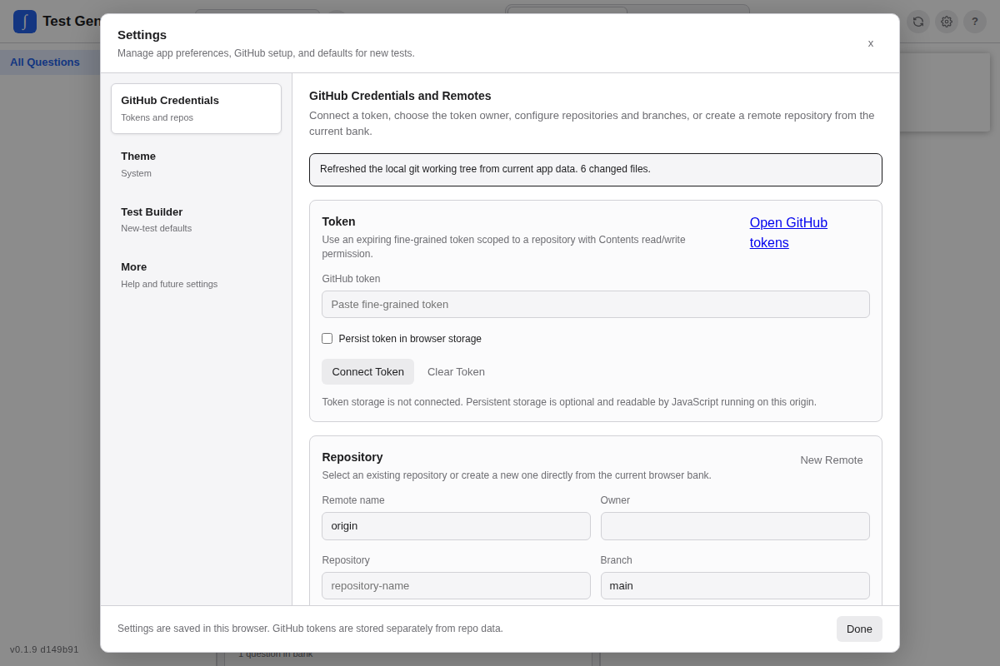

The Gradebook tab is an experimental roster and score-entry area for tests built in the app. Enable it under **Settings -> More -> Gradebook (experimental)**.

Gradebook course sections are rostered groups of students such as “Period 2 AP Calc”. They are separate from curriculum classes in the question bank. Classes are available across banks, and **New class** creates one without requiring questions or saved tests.

## Course Sections and Rosters

Create a course section with:

- Section name
- Optional course (linked curriculum class)
- Optional term label
- Category weights

Use **Edit section** beside the section name to change its name or term after creation.

Students have stable generated IDs, optional SIS IDs, first and last names, an optional **Known by** name (the name they go by, such as Kate for Katherine), optional email addresses, and active/inactive status. The Gradebook shows students by their known-by name, falling back to their first name.

Overview lists students once in the **Score Grid**. Use **Points / Percentage** beside the grid to choose how assessment scores appear. Click **Student**, an assessment heading, or **Total** to sort; click again to reverse the order. Ungraded scores stay at the bottom when sorting by grades. Use **Add Students** and **Import Roster** in Overview's right pane to manage the roster, and select a name in the grid to edit details or active status. Hiding the right pane also hides its roster controls.

Choose **First Last** or **Last, First** under **Settings -> More -> Student names**.

Names are saved exactly as typed in Student view, so casing like McKenna or DeSouza can be fixed by hand. Ending an enrollment or marking a student inactive keeps existing scores.

Use the left pane to select sections. To put a section away, open it and scroll to the bottom of **Overview**:

- **Archive section** keeps a finished section, with its roster and scores, out of the active list. Restore it from **Archived** in the left pane at any time.
- **Move to Trash** is for a section you mean to delete. It can be restored from **Trash** in the left pane until you choose **Delete** there, which removes its roster entries, assessments and scores for good. Students enrolled in other sections keep those records.

## Roster Import

The **Add Students** panel can import PowerSchool-style exports from CSV, TSV, or plain text. The importer recognizes common columns such as:

- Student Number
- Student ID
- First Name
- Last Name
- LastFirst
- Student Name
- Email
- Expression / Period / Section
- Term

- Known By / Preferred Name / Nickname

Names that arrive in ALL CAPS or all lowercase are converted to proper caps (`MCKENNA` becomes `Mckenna`, `o'brien` becomes `O'Brien`). Names that already mix upper and lower case are kept as they are. If you fix a name's casing by hand, re-importing the roster keeps your version.

Imports happen in the browser. Matching SIS IDs, emails, legal names, or known-by names update existing students and enroll them in the selected section instead of creating duplicates. New IDs and email addresses merge into the existing record; blank imported fields keep existing information. ID columns can be named **ID**, **Student ID**, **Student IDs**, **Student #**, or **Student Number**, and leading zeros are preserved.

## Assessment Snapshots

A section linked to a course defaults to showing saved tests from that course. Check **Show tests from all courses** to choose another course's test or an unclassified test. Saved tests from other banks are available too. Change a section's course from the dropdown under its name. A section with no course shows all saved tests. **Add to Gradebook** in Build can add a test to any active section, listing matching courses first.

A saved test is a reusable template. A Gradebook assessment is an administered instance.

When a saved test is added to the Gradebook, the app freezes:

- Saved test ID and name
- Test title and subtitle
- Selected question IDs and order
- Question labels
- Point values at that moment
- Base total points
- Bonus points
- Question-level bonus flags
- Test type/category
- Administered date

This keeps old grades from changing when a saved test is edited or a question’s point value changes later.

### External Assessments

For a test, lab, or assignment not made in TestGen, open **Add an external assessment** in the Assessments panel and enter:

- Name
- Category (Quiz, Test, Assignment, and so on), which sets its weighting
- **Out of**, the total marks
- Optional **Question marks**, such as `2, 2, 3, 5`, to grade it question by question. The total is then the sum of the marks.

It uses the date beside **Add to Gradebook**. Without question marks it is graded as a total only. External assessments are labelled "External" in the list and count toward totals like any other assessment. They are not limited by the section's course.

### Editing and Removing Assessments

Open an assessment in the Grading view and click **Edit** to change its name, category, or date.

For external assessments you can also fix **Out of** or the **Question marks**:

- Removing a question that already has scores asks first. It then deletes those question scores and re-adds each student's total from the questions that remain.
- Clearing all question marks turns the assessment into Total only. Each student's total is kept and only the question detail is deleted.

Question marks on saved-test assessments stay frozen, so past grades don't change unless you change one yourself (below).

### Changing What a Question Is Out Of

In the Grading view, click a question's heading (for example **Q3 / 4**) to change what it is out of. Use **0** to leave a question out of the total, for example when the class skipped it because of a typo, or a smaller number when only part of it counts.

- If some students already scored above the new value, **Lower … scores** (on by default) brings those scores down to it and re-adds their totals. Untick it to keep their scores.
- For an assessment from a saved test, choose **Gradebook only** to change just this assessment, or **Gradebook and test** to also change the question's value in the saved test, so a reprint matches. The saved test gets its own copy of the question; the bank is not changed.
- An external assessment has no saved test, so it just has **Save**.

**Remove from Gradebook**, in the same panel, deletes the assessment and all of its recorded scores after confirmation. This cannot be undone, so take a JSON backup first if you might need the scores.

Editing a saved test's Quiz/Test/Assignment/Exam/Formative/Worksheet type updates matching Gradebook assessment categories because that type controls section weighting. It does not create a new question snapshot or change point values.

## Score Entry

The overview score grid shows students by assessment. Selecting an assessment opens the full **Grading** view.

The right pane lists every assessment. Select one to start grading; select it again to expand its question snapshots. The Total column shows the assessment's possible marks below its heading.

The Grading view supports spreadsheet-style per-question score entry:

- Type directly into cells.
- Arrow keys move to adjacent cells. Enter moves down (Shift+Enter up) and Tab moves right (Shift+Tab left). Tab past a student's last question continues on the next student's first question, and wraps around the grid.
- Cell contents are selected for quick replacement.
- Type letters to jump to a student. Typing `ja` highlights the first student whose name starts with "Ja" and moves to their first question, ready for grades. Entering a grade or pressing Escape ends the search.
- **Sort: First / Last** orders students by known-by name or last name.
- Score entry saves automatically a moment after you stop typing.
- Decimal scores can start with `.`, such as `.5`.
- Question scores are tallied into the assessment-level score.

### By Question or Total Only

Each assessment records scores either **By question** (one cell per question, tallied into a total) or **Total only** (one score per student). Switch with **Entry** in the Grading header. Keyboard movement, Tab cycling, and type-to-find work the same way in both.

New assessments use the default under **Settings -> More -> New assessments**. Switching an assessment keeps every recorded score:

- Question scores are already summed into totals, so Total only shows them straight away.
- Typing a total that differs from a student's question scores replaces those question scores.
- Switching back to By question warns if some students only have totals. Their total stays until you enter a question score for them.

Assessment-level score entry is still available in the detail rail for quick edits.

## Student View

Click a student name or total to open the Student view. The current student name opens a dropdown for switching students in the same section. Use **Search student or student ID** to filter by legal name, known-by name, or SIS ID across active sections. Matches in another section show the class name in parentheses; selecting one opens that student's section. Press Enter to open the first match.

Student view shows:

- Final grade
- Category totals such as Quiz and Test
- Assessments grouped under their categories
- Expandable per-assessment question scores for that student only
- Editable local roster details
- Active/inactive enrollment controls
- **Archive in Section** ends only this enrollment and keeps scores.
- **Remove from this section** deletes only this enrollment and its scores.
- **Active across all sections** changes the student's overall status.
- **Delete from all sections** deletes the student and every enrollment and score after confirmation.

Clicking an assessment in Student view expands that student's per-question details in place. It does not navigate to the Grading view, so other students' scores are not exposed.

## Score States and Totals

Score states include:

- Score
- Missing
- Excused
- Absent
- Incomplete

Category percentages use the sum of earned marks divided by the sum of possible marks for graded assessments. Finals apply the section's category weights to those same percentages; categories without graded scores are left out and the remaining weights are scaled proportionally.

Normal numeric scores count toward totals. Bonus question points can raise earned points above the base denominator. Dropped scores, retakes, late penalties, curves, and standards-based reporting are left for later phases.

## Data Sensitivity

Gradebook data is stored in this browser under `tg-gradebook-v1` and shared across question banks. A connected workspace stores it in `gradebook/gradebook.json`. It is not currently projected into GitHub repo sync or Google Drive backup.

Existing browser bank gradebooks migrate into the shared gradebook once, matching records by their stable IDs and keeping the newest copy. Original bank copies remain available for recovery. Connected workspaces keep their existing gradebook without merging old browser bank copies.

Treat grade data as sensitive student information. Export or share it only when you mean to.

## Backup and Restore

The left pane has Gradebook backup controls:

- **Backup JSON** downloads a full restore-capable Gradebook backup, including sections, students, enrollments, assessment snapshots, question-level scores, score states, settings, and archived and trashed sections.
- **Restore** imports a Gradebook JSON backup and replaces the current local Gradebook in this browser after confirmation.
- **Scores CSV** downloads a spreadsheet-friendly score export for review, reporting, or manual analysis.

Use JSON backups for recovery. CSV exports are flat reports; they are not the restore format because they cannot preserve the full Gradebook structure.
