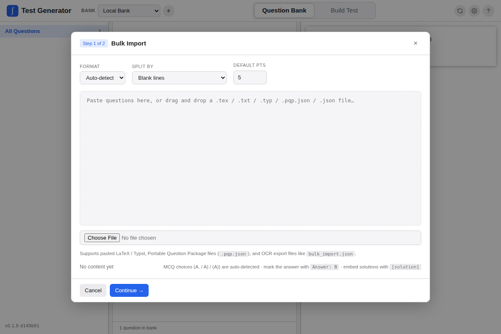

Test Generator keeps normal work in the browser. Import, export, and sync only happen when you start them.

## Import Options

| Button | Use it for |
|---|---|
| **Bulk Import** | Pasted text, LaTeX, Typst, PQP, JSON, and image-assisted review workflows. |
| **Import PQP / JSON** | Prepared `.pqp.json` files or plain JSON question arrays. |
| **Export JSON** | Downloading a question-bank backup from the active bank. |

## Bulk Import

Use **Bulk Import** when you want the app to parse and review a batch before it enters the bank.



Bulk Import can:

- Split pasted content into individual questions.
- Convert common LaTeX math to Typst.
- Preserve Typst input as-is.
- Preserve exam-style parts and subparts as nested lists.
- Recognize multiple-choice answer choices.
- Detect image references and prompt for files.
- Let you edit points, tags, class, unit, and section before committing.

### Pasting Tips

- Put a blank line or a clear question number between questions.
- Label choices consistently, such as `A.`, `B.`, `C.`, `D.`.
- Keep answer keys or explanations near the related question.
- Paste one lesson, worksheet, or assessment at a time so review stays manageable.
- Import a small sample first if the source formatting is unfamiliar.

## Images During Import

If pasted LaTeX contains `\includegraphics[...]{name}`, the importer lists referenced filenames and lets you upload matching files.

- Files are matched by basename, case-insensitive, ignoring extension.
- Supported extensions include `.png`, `.jpg`, `.jpeg`, `.svg`, `.webp`, `.gif`, and `.pdf`.
- `width` and `height` options are translated to Typst `#image(...)` arguments.
- Missing images do not block import; they stay visible in the review sidebar.

Images are stored in this browser and mounted into the app's Typst compiler at `/imgs/<name>.<ext>`.

## Import PQP / JSON

Use **Import PQP / JSON** when you already have a prepared file.

Supported inputs include:

- Portable Question Package files such as `chapter-01.pqp.json`.
- Plain JSON arrays of question objects.

Minimal plain JSON import:

```json
[
  {
    "body": "Evaluate $lim_(x -> 0) frac(sin x, x)$.",
    "points": 5,
    "tags": ["calculus", "limits"],
    "solution": "The limit equals $1$."
  }
]
```

Multiple-choice JSON import:

```json
[
  {
    "body": "What is $frac(d, d x)[sin x]$?",
    "points": 2,
    "choices": {
      "A": "$cos x$",
      "B": "$-cos x$",
      "C": "$-sin x$",
      "D": "$tan x$"
    },
    "answer": "A",
    "solution": "$frac(d, d x)[sin x] = cos x$.",
    "tags": ["derivatives", "trig"]
  }
]
```

Use [Portable Question Package](./portable-question-package.md) when the file needs to carry curriculum placement, assets, algorithm metadata, graph metadata, or detailed import diagnostics.

## Review Before Committing

For each batch:

1. Check the parsed question body.
2. Confirm MCQ choices and the correct answer.
3. Add or correct point values.
4. Assign curriculum class, unit, and section.
5. Add tags that will help with search and filtering.
6. Confirm images render or are listed for upload.
7. Commit the reviewed questions to the bank.

## Export JSON

Use **Export JSON** to download a question-bank backup. This is the simplest way to protect local work before large edits or browser changes.

Basic JSON export includes question data and image references. Keep original image files when moving a bank to another browser unless you are using an import path that carries or reattaches assets.

## GitHub Sync

The sync panel supports browser-side git operations for the active bank:

- Refresh local git data from app state.
- Commit.
- Choose a configured remote.
- Fetch.
- Fast-forward pull.
- Push.

Set up GitHub in **Settings -> GitHub Credentials**. Tokens are stored separately from repo data, default to session-only storage, and should be fine-grained, expiring tokens scoped to the selected repository with Contents read/write permission.

Pull is fast-forward only and requires a clean working tree. Diverged histories stop without modifying local refs or app data.

## Google Drive Backup

Google Drive setup can be shared across banks, while the chosen Drive folder and sync metadata are stored per bank.

The Drive panel can:

- Upload class-backed questions and saved tests.
- Refresh the remote class index.
- Restore saved tests.

Gradebook data is not included in Question Bank GitHub sync or Google Drive backup. Use Gradebook **Backup JSON** for roster and score data.
