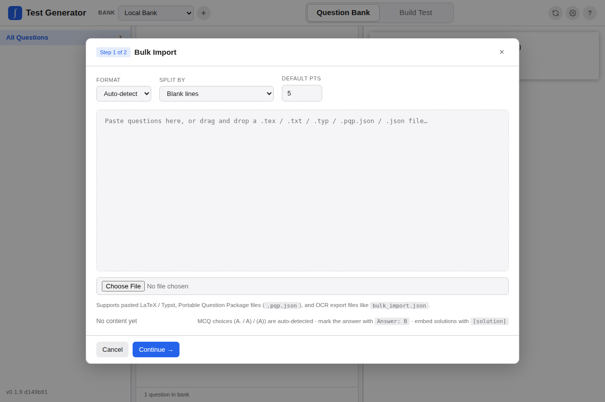

Test Generator keeps normal work in the browser. Import, export, and sync only happen when you start them.

For ongoing local-folder autosave with separate banks, tests, and private student
records, see [Independent Local Workspace](local-workspace.md).

## Import Options

Imports start from the **Editor**. Click **Bulk Entry / Import** to paste text or drop a file:

| Input | Use it for |
|---|---|
| Pasted text | LaTeX, Typst, or mixed exam content, with image-assisted review. |
| `.pqp.json` / `.json` file | Prepared Portable Question Packages or plain JSON question arrays. |

Reviewed questions are staged as Editor drafts; save them to add them to the bank.

To add or manage image files outside an import, use **Image library** in the Question Bank or Editor toolbar.

## Bulk Entry / Import

Use **Bulk Entry / Import** when you want the app to parse and review a batch before it enters the bank.



Bulk Entry / Import can:

- Split pasted content into individual questions.
- Convert common LaTeX math to Typst.
- Preserve Typst input as-is.
- Preserve exam-style parts and subparts as nested lists.
- Recognize multiple-choice answer choices.
- Detect image references and prompt for files.
- Let you edit points, tags, class, unit, and section before committing.

### Step 1: Paste

Paste text, or drop or choose a `.tex`, `.txt`, `.typ`, `.pqp.json` or `.json` file. Then choose:

- **Format**: **Auto-detect**, **Typst**, or **LaTeX**. LaTeX is converted to Typst.
- **Split**: how the text is divided into questions — **Question commands (`\question`)**, **Question numbers (1. 2. 3.)**, a **Custom delimiter**, or **Blank lines**. `\question` commands are used whenever the text has them.

An import in progress is saved in the browser. When you reopen the dialog, **Restore** continues it and **Discard** starts fresh.

### Step 2: Review & Assign

Each parsed question is shown with its converted Typst, choices, correct answer, solution, points and tags, and a rendered preview.

- **LaTeX** shows the original LaTeX beside the converted Typst. **↺ re-convert** converts one question again from its original.
- The theme button switches the preview between light and dark.
- **Class**, **Unit**, **Section** and **Tags** at the top apply to the selected questions (**Select all** / **None**). **＋ New class…**, **＋ Add unit…** and **＋ Add section…** create curriculum as you go.
- **Detected curriculum** lists units and sections found in the source comments; **Add autodetected units/sections** creates the missing ones in the chosen class.
- For a PQP file, **Add metadata to bank** creates the package's classes, units and sections. It happens automatically when the package brings curriculum the bank doesn't have.
- **✕** or **Remove** takes questions out of the import. **＋ Add more** pastes another batch and appends it.
- **Stage in Editor** sends the selected questions to the Editor as drafts. If some fail to compile, you're asked first (**Yes, import** or **Cancel**).

Keyboard: `↓`/`↑` move between questions, Space selects, Delete removes, and Ctrl/Cmd+A selects all or none.

### Pasting Tips

- Put a blank line or a clear question number between questions.
- Label choices consistently, such as `A.`, `B.`, `C.`, `D.`.
- Keep answer keys or explanations near the related question.
- Paste one lesson, worksheet, or assessment at a time so review stays manageable.
- Import a small sample first if the source formatting is unfamiliar.

## Images During Import

If pasted LaTeX contains `\includegraphics[...]{name}`, the importer lists referenced filenames and lets you upload matching files.

- Files are matched by basename, case-insensitive, ignoring extension.
- Supported extensions include `.png`, `.jpg`, `.jpeg`, `.svg`, `.webp`, `.gif`, and `.pdf`.
- `width` and `height` options are translated to Typst `#image(...)` arguments.
- Missing images do not block import; they stay visible in the review sidebar.
- **Automatically rename matched images with curriculum and question metadata** gives uploaded images descriptive names (class, unit, question number and keywords) and updates the references.

Images are stored in this browser and mounted into the app's Typst compiler at `/imgs/<name>.<ext>`.

## PQP and JSON Files

When you already have a prepared file, drop it onto the **Bulk Entry / Import** box or choose it with the file picker.

Supported inputs include:

- Portable Question Package files such as `chapter-01.pqp.json`.
- Plain JSON arrays of question objects.

Minimal plain JSON import:

```json
[
  {
    "body": "Evaluate $lim_(x -> 0) frac(sin x, x)$.",
    "points": 5,
    "tags": ["calculus", "limits"],
    "solution": "The limit equals $1$."
  }
]
```

Multiple-choice JSON import:

```json
[
  {
    "body": "What is $frac(d, d x)[sin x]$?",
    "points": 2,
    "choices": {
      "A": "$cos x$",
      "B": "$-cos x$",
      "C": "$-sin x$",
      "D": "$tan x$"
    },
    "answer": "A",
    "solution": "$frac(d, d x)[sin x] = cos x$.",
    "tags": ["derivatives", "trig"]
  }
]
```

Use [Portable Question Package](./portable-question-package.md) when the file needs to carry curriculum placement, assets, algorithm metadata, graph metadata, or detailed import diagnostics.

## Review Before Committing

For each batch:

1. Check the parsed question body.
2. Confirm MCQ choices and the correct answer.
3. Add or correct point values.
4. Assign curriculum class, unit, and section.
5. Add tags that will help with search and filtering.
6. Confirm images render or are listed for upload.
7. Stage the questions in the Editor, then save them to the bank.

## Local folder storage

Chrome, Edge, Brave, Chromium, and other browsers that implement the File System Access API can store the active bank in a folder on your computer. Select the folder button in the header, then choose a directory.

- If the directory does not contain a Test Generator bank, the app initializes it from the active bank.
- If it already contains a bank, the app asks before replacing the active browser bank with the folder contents.
- Questions, custom classes, narratives, saved tests, and bank images are stored as readable files using the same layout as Git sync.
- Changes are saved automatically while the app is open. You can also save immediately or explicitly reload from the folder.
- Only one bank is linked to a folder at a time. Switching banks leaves that link with its original bank; choosing a folder for another bank moves the connection.

Browser-only drafts, credentials, sync configuration, and Gradebook records are not written to the folder. Chromium may ask you to grant folder access again after restarting the browser.

## GitHub Sync (advanced)

Git, GitHub and Google Drive remote sync are advanced features and are off by default. Turn them on in **Settings -> More -> Git and GitHub sync (advanced)** to show the **Sync** button and the **GitHub Credentials** settings. Turning the option off only hides these features; saved tokens, remotes and repository history stay in the browser.

The sync panel supports browser-side git operations for the active bank:

- **Update test bank**: refresh the local Git working tree from the app's data.
- **git commit**, **git fetch**, **git pull --ff-only** and **git push**, with the remote chosen in Settings.
- **Large Transfer**: upload the whole bank as one compressed snapshot, or restore it from GitHub. Use it for a first sync, a big backup, or restoring a large bank.

Set up GitHub in **Settings -> GitHub Credentials**. Tokens are stored separately from repo data, default to session-only storage, and should be fine-grained, expiring tokens scoped to the selected repository with Contents read/write permission.

Pull is fast-forward only and requires a clean working tree. Diverged histories stop without modifying local refs or app data.

## Google Drive Backup

Google Drive setup can be shared across banks, while the chosen Drive folder and sync metadata are stored per bank.

The Drive panel can:

- Upload class-backed questions and saved tests.
- Refresh the remote class index.
- Restore saved tests.

Gradebook data is not included in Question Bank GitHub sync or Google Drive backup. Use Gradebook **Backup JSON** for roster and score data.
