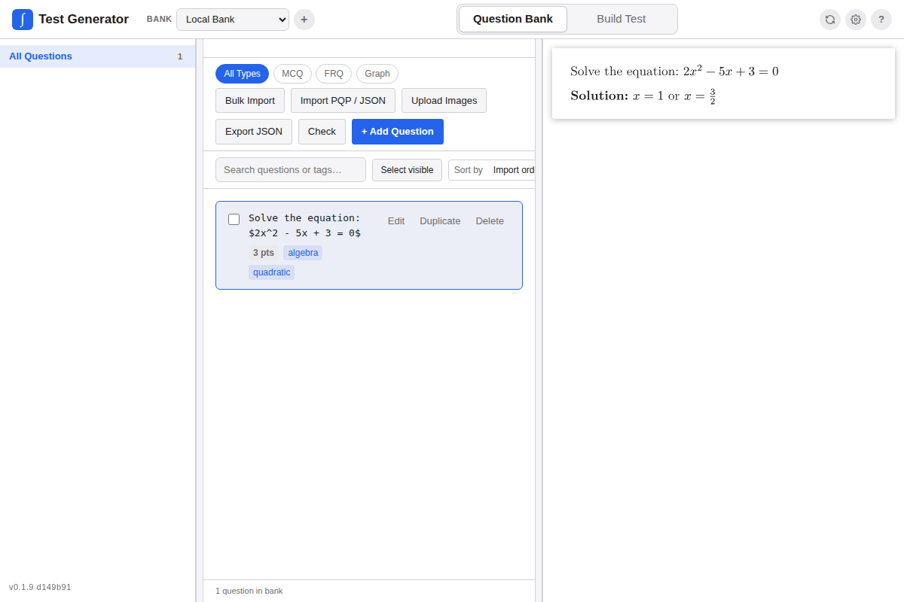
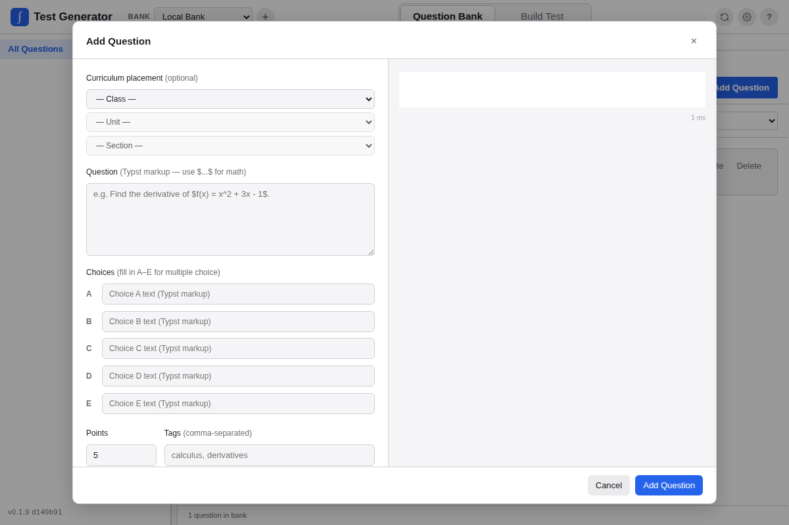

The Question Bank is where questions live. You can write questions in Typst, import them from supported formats, organize them by curriculum, preview them, edit them, and later pull them into the Test Builder.

## Layout

The bank view has three panels:

- Curriculum sidebar on the left
- Question list in the center
- Live preview panel on the right

Drag the divider handles to resize panels. Click a divider to collapse or expand the panel next to it.

## Curriculum Organization

Questions can be assigned to a **curriculum class -> unit -> section** hierarchy. This is a math-course organization such as Algebra 2 or AP Calculus, not a rostered class period.

The sidebar lets you browse and filter by unit or section. Units are listed in numeric order. Clicking a unit or section filters the question list, and **Add Question** pre-fills the curriculum fields from the current selection.

The app does not ship with production curriculum classes. Create your own classes during Bulk Import or while assigning a question in the editor.

Each class in the sidebar has an info button with question counts by unit and section. Custom classes, units, and sections can be renamed there.

## Adding Questions

Each question has:

| Field | Description |
|---|---|
| Curriculum | Optional class, unit, and section assignment. |
| Body | Question text in Typst markup. |
| Choices | Optional MCQ choices A-E. Enter at least two to activate MCQ mode. |
| Correct answer | For MCQs, the correct letter. |
| Explanation / Solution | Optional written explanation or full solution. |
| Points | Numeric point value. Decimals such as `0.5` are allowed. |
| Tags | Comma-separated labels used for filtering. |

## MCQ Questions

If two or more choices are filled, the question is treated as multiple choice. Choices are laid out in a two-column grid in the generated PDF. Setting the correct answer enables the answer key.

## Editing and Deleting

Use **Edit** or **Delete** on any question card. Question deletion is permanent, so export a JSON backup first if you might need the question later.

## Algorithmic Imported Questions

Questions imported from PQP or supported JSON files can include an `algorithmModel`. When usable algorithm definitions exist, the bank card and preview panel show calculation controls:

- Generate a random seeded variant for one question.
- Enter a numeric seed to reproduce a variant.
- Store the generated seed and materialized values back on the question.

This recalculation happens inside the app. The app uses the imported algorithm definitions, sample values, graph metadata, and diagnostics to create a materialized question variant.

See [Algorithmic Questions](./algorithmic-questions.md) for the full workflow, data model, expression support, examples, and manual review checklist.

## Searching and Filtering

- The search bar performs fuzzy search across body, tags, solution, and answer.
- Class tabs filter by curriculum class when multiple classes exist.
- Type tabs filter by All, MCQ, FRQ, or Graph.
- The sidebar tree drills down to a unit or section.

## Preview

Click a question card to preview it in the right panel. Use `j`/`k` or arrow keys to navigate between questions. Press `Escape` to close the preview.
