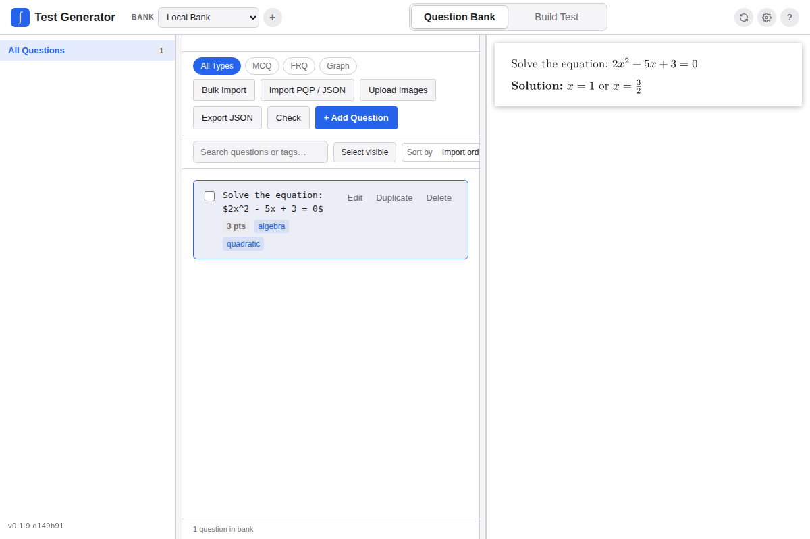
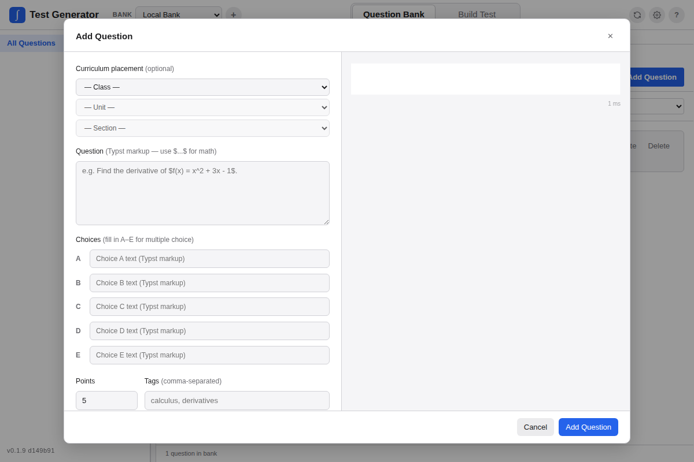

The Question Bank is where questions live. You can write questions in Typst, import them from supported formats, organize them by curriculum, preview them, edit them, and later pull them into the Test Builder.

## Layout

The bank view has three panels:

- Curriculum sidebar on the left
- Question list in the center
- Live preview panel on the right

Drag the divider handles to resize panels. Click a divider to collapse or expand the panel next to it.

## Curriculum Organization

Questions can be assigned to a **curriculum class -> unit -> section** hierarchy. This is a math-course organization such as Algebra 2 or AP Calculus, not a rostered class period.

The sidebar lets you browse and filter by unit or section. Units are listed in numeric order. Clicking a unit or section filters the question list. New questions are created in the **Editor** with **+ New Question**.

The app does not ship with production curriculum classes. Create your own classes during **Bulk Entry / Import** or while assigning a question in the Editor.

Each class in the sidebar has an info button with question counts by unit and section. Custom classes, units, and sections can be renamed there.

## Adding Questions

Questions are written in the [Editor](./editor.md). Each question has:

| Field | Description |
|---|---|
| Curriculum | Optional class, unit, and section assignment. |
| Body | Question text in Typst markup. |
| Choices | Optional MCQ choices A-E. Enter at least two to activate MCQ mode. |
| Correct answer | For MCQs, the correct letter. |
| Explanation / Solution | Optional written explanation or full solution. |
| Points | Numeric point value. Decimals such as `0.5` are allowed. |
| Tags | Comma-separated labels used for filtering. |

## Banks

The bank switcher at the top of the Bank view's left pane shows the active bank (on a phone, it sits above the question list). Choose another bank to switch; click **+** to create a new, empty local bank (you are asked for its name). Each bank has its own questions, curriculum classes, narratives, saved tests and images. Click **✎** to rename the active bank. Banks can't be deleted from the app; in a [local workspace](./local-workspace.md) each bank is a folder under `banks/`, and its display name is in `bank-name.json`.

The app has four tabs: **Bank** (find, organize and preview questions), **Editor** (write and import questions), **Build** (make tests) and, when enabled, **Gradebook**.

## MCQ Questions

If two or more choices are filled, the question is treated as multiple choice. Choices are laid out in a two-column grid in the generated PDF. Setting the correct answer enables the answer key.

## Question Cards

Each card shows the question's curriculum, type, points and tags, with buttons to:

- **Edit** the question in the [Editor](./editor.md).
- **Duplicate** it. The copy opens in the Editor as a new draft; the original is unchanged.
- **Delete** it. Deletion is permanent, so back up first if you might need the question later.

A ❌ on a card means its last render check failed (hover for the error), and ◯ means it hasn’t been checked yet.

## Toolbar

| Control | What it does |
|---|---|
| Search | Fuzzy search across body, tags, solution and answer. |
| Class tabs | Filter to one curriculum class (shown when the bank has more than one). |
| **All Types / MCQ / FRQ** | Filter by question type. |
| **Graph** | Show only questions tagged `graph`. |
| **Algorithmic** | Show only algorithmic questions: those with **New variant**. Combines with the type and Graph filters. |
| Tags | Filter by exact tags. **All** requires every checked tag; **Any** accepts any of them. |
| **Check** | Render-check the visible questions: each one is compiled with Typst, and failures are marked. While it runs, the button stops it. Afterwards, **❌ *n* errors** shows only the failures. |
| Sort | **Import order**, **Date added (newest first)**, **Point value (highest first)**, **Unit**, or **Last edited (newest first)**. |
| **Select visible** | Check every question that matches the current filters, across all pages. |
| **Image library** | Browse, upload, rename, edit and delete the bank's images. See [Pictures and Graphs](./editor.md#pictures-and-graphs). |

The list shows 100 questions per page; use **Previous** and **Next** below it.

With a class selected, the class info button shows question counts by unit and section and lets you rename the class, its units and its sections. **Remove all questions…** permanently deletes every question in that class, after a confirmation.

## Selecting and Changing Many Questions

Check a question's box to select it. Shift-click selects a range; Ctrl/Cmd-click toggles one question; Ctrl/Cmd+A selects every visible question.

With questions selected, a panel lets you change them all at once:

- **Class**, **Unit**, **Section**: **Keep**, **Clear**, **Add new** (type a name), or choose an existing one.
- **Points**: leave blank to keep each question's points.
- **Tags**: **Keep**, **Add** (append these tags), **Remove** (take these tags off), **Replace** (use exactly these tags) or **Clear**.

**Apply** changes the selected questions, **Delete** deletes them, and **Clear** deselects them. **Add to…** adds them to a test (see below).

## Keyboard Shortcuts

| Key | Action |
|---|---|
| `j` / `↓` | Next question |
| `k` / `↑` | Previous question |
| `Esc` | Close the preview and clear the selection |
| Ctrl/Cmd+A | Select every visible question |

## Import Inspector

Questions imported with algorithm, graph or diagnostic metadata show an **Import inspector** under the preview. It lists the **Algorithm** definitions, the decoded **Graph** objects, and any **Diagnostics** the importer recorded. If a question fails to render, **Full error** under the preview shows the complete Typst error.

## Algorithmic Imported Questions

Questions imported from PQP or supported JSON files can include an `algorithmModel`. When usable algorithm definitions exist, the bank card and preview panel show calculation controls:

- **New variant** on the card calculates new values with a random seed.
- In the preview, **New variant** uses the number in the **Seed** field if you typed one (to reproduce a variant), or a random seed. The **Variant** menu switches between the original and every earlier variant, and **Manage variants** deletes old ones, one at a time or all at once.
- The seed and values are stored on the question, and redrawn graphs are added to the Image library.

This recalculation happens inside the app. The app uses the imported algorithm definitions, sample values, graph metadata, and diagnostics to create a materialized question variant.

See [Algorithmic Questions](./algorithmic-questions.md) for the full workflow, data model, expression support, examples, and manual review checklist.

## Adding Questions to a Test

Check one or more questions in the bank, then choose **Add to…**:

- **Current test** adds them to the end of the test open in Build, in the order the bank lists them. Questions already in the test are skipped, and the message says how many.
- **New test** starts a new unsaved test with just those questions. Nothing is lost: a named test is saved first, and an unsaved test that already had content is kept in **Saved Tests** as "Unsaved test – *date and time*", ready to rename or delete.

Use **Open in Build** in the message to continue in Build. The questions stay checked.

The Editor has the same **Add to…** button. There you can check drafts and bank questions. A draft of a bank question adds that bank question as it is saved in the bank; save the draft first to include your edits. New drafts that are not in the bank yet are skipped until you save them.

## Preview

Click a question card to preview it in the right panel.

Use **New class** in the Bank view to create a class before adding questions or saving tests. The Bank sidebar shows only the active bank’s classes. Classes created here can also be selected in the Gradebook across banks. Creating a class in the Gradebook does not add it to a bank; use **New class** in that bank to add it explicitly.
