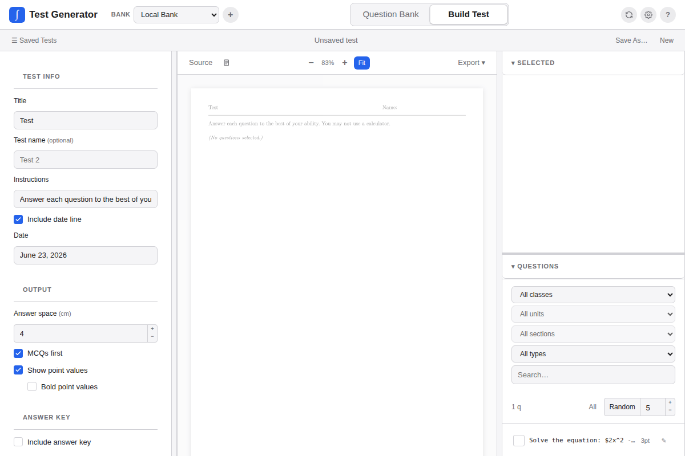

The Test Builder turns selected bank questions into a Typst-backed PDF. It also saves test templates you can reuse later.

## Layout

The Build Test view has three panels:

- Settings on the left
- PDF preview in the center
- Question picker on the right

When you switch to Build Test, the title and class filter default to the last class viewed in the Question Bank.

## Saved Tests

The current test auto-saves as a local draft. Refreshing the page restores it.

Use **Save As** to save a named test. Saved tests are templates. They keep selected question IDs, layout settings, answer-key settings, point display settings, bonus question flags, curriculum metadata, and test type.

Saved tests can be:

- Loaded from the Saved Tests panel
- Renamed
- Deleted
- Added to the experimental Gradebook

## Test Type

Saved tests can be labeled as:

- Quiz
- Test
- Assignment
- Exam
- Formative
- Other

The Gradebook uses this type for category grouping and course-section weights.

## Bonus Questions

In the selected-question list, use the bonus control to mark a question as bonus. Bonus questions keep their own point value and are labeled in the generated Typst/PDF output. In Gradebook snapshots, bonus points are kept separate from the base denominator.

## Adding a Saved Test to Gradebook

In the Saved Tests panel, use the add-to-gradebook action on a saved test. This creates a Gradebook assessment snapshot. Later edits to the saved test or question point values do not change old grades.

If the saved test type/category changes later, matching Gradebook assessments update that category for totals. The frozen question order and point values stay the same.

## Settings

### Test Settings

| Setting | Description |
|---|---|
| Title | Appears centered at the top. Tracks the selected class automatically. |
| Test name | Optional second line below the title. |
| Instructions | Shown below the name line in italics. |
| Include date line | Toggles a date line on the test. |

### Output

| Setting | Description |
|---|---|
| Answer space | Blank vertical space below each question. |
| MCQs first | Places multiple-choice questions before free-response questions. |
| Show point values | Toggles point labels next to question numbers. |
| Bold point values | Renders point labels in bold. |

### Answer Key

| Setting | Description |
|---|---|
| Include answer key | Appends a separate answer key section. |
| Include full MCQ solutions | Includes MCQ explanations in the verbose solution section. |

### Formatting

| Setting | Description |
|---|---|
| Font size | Body text size: 10, 11, or 12 pt. |
| Paper | US Letter or A4. |
| Margin | Page margin in inches. |
| Edit preamble manually | Opens a raw Typst preamble editor and bypasses form controls. |

### Graph Defaults

Graph defaults configure global rendering options for `simple-plot` graphs embedded in questions: grid visibility, colors, stroke weights, graph dimensions, and tick intervals.

## Selecting Questions

Questions appear in the right picker. Filter by class, unit, section, type, or search query. Use **All** to add every visible question or **Random** to add a sample.

The selected list controls order and per-question options. Drag the handle to reorder, remove questions with the remove button, and use the per-question answer-space override when needed.

For MCQs, controls can shuffle one question's choices, reset a shuffle, or shuffle all selected MCQs.

## Preview and Export

The preview pane compiles the current test with the Typst WebAssembly compiler and displays it inline. The first compile on a fresh page load downloads the Typst engine, which the browser caches.

The preview toolbar can:

- Show raw Typst source
- Download the test PDF
- Download answer key PDFs when enabled
- Download the `.typ` source
- Print the test
