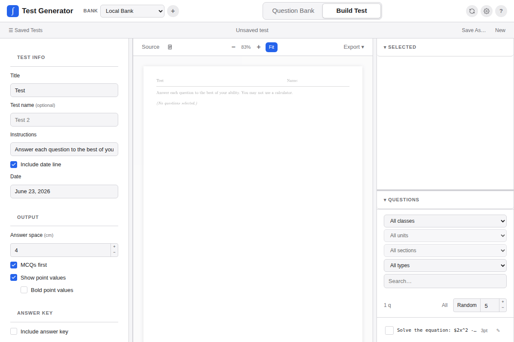

The Test Builder turns selected bank questions into a Typst-backed PDF. It also saves test templates you can reuse later.

## Layout

The Build view has three panels:

- Settings on the left
- PDF preview in the center
- Question picker on the right

The picker's class filter follows the last class viewed in the Bank. It only filters questions; it never changes the test's title.

## Saving Tests

The test you're working on saves automatically. A named test is updated in place a moment after each change, and a recovery copy is kept in the browser immediately, so closing the tab or refreshing never loses edits. The status next to the test name shows **Saved locally** once the browser copy is written; a connected folder or sync shows its own status. **Save** (Ctrl/Cmd+S) saves right away. If a save fails, the message has **Retry save**, and your edits stay on screen.

- **Save As…** saves a copy under a new name, with its class, unit and type. You can create a class or unit, or a custom type with **Other…**, in the same dialog.
- **New** starts a new unsaved test. If the current unsaved test has content, you're asked first.
- Double-click the test name to rename it.

Saved tests keep the selected questions and their order, layout settings, answer-key settings, point display, bonus flags, curriculum and test type.

The **Saved Tests** list can load a test, rename it (**✎**), delete it (**✕**), or add it to the Gradebook (**＋**).

## Editing a Question in a Test

Use **✎** on any question in the selected-question list to open it in the Editor. The Editor shows only that question, with three choices:

- **Save for this test** keeps the change in this test only. The bank question is not changed.
- **Save in original bank** overwrites the question in the bank it came from, even when that is another bank in a connected workspace folder, and uses the change in this test too. Other saved tests keep their own copies.
- **Cancel** leaves without saving.

A question made in Generate has no bank. It offers **Edit in Generator** instead, which opens its settings in Generate; the questions you make there replace it in the test. If a question's bank original has been deleted, only **Save for this test** is offered.

Changing a question's choices or solution clears any shuffled choice order for it in this test.

## Shared Instructions and Narratives

Questions in a row that share the same instruction or narrative print it once, as one numbered item, with the questions lettered a), b), c) under it. This happens wherever the questions came from and whatever they ask: a passage shared by bank questions, two Generate sections that are both "Evaluate.", or the Easy, Medium, and Hard sections of one outcome. The match is on the text, so the same wording on two unrelated questions counts too. A question on its own, or the same narrative further down the test after something else, starts a new number.

## Questions from Generate

Each section of a Generate worksheet prints as one numbered item: its instruction once, then its questions lettered a), b), c) across the row, like LaTeX's `tasks`. For example:

> **1.** Factor completely.
> a) x² + 3x + 2 &nbsp;&nbsp; b) x² − 9 &nbsp;&nbsp; c) x² − 5x + 6

- **Instruction.** When every question in a section starts the same way, such as "Factor completely:" or "Evaluate", that becomes the instruction and each question keeps only what follows. Otherwise the questions stay whole under "Answer each question." Edit the instruction in the box at the top of the section in Generate.
- **Columns.** Auto fits short items four to a row and long items one to a row. Multiple-choice options and drawings get more room. Choose 1 to 4 to set it yourself. When sections with the same instruction continue one item, each column setting gets its own rows and the letters carry on.
- **Continuing sections.** In Generate, a section with the same instruction as the one above shows the same number with a dashed border and "Continues 2". Its letters carry on from the section above. Give it a different instruction to make it its own item.
- **Numbering.** Build's list and the answer key use the printed labels, such as 2b. With **MCQs first**, a whole multiple-choice section moves together. A section with one question prints as an ordinary numbered question.
- **Points** print once for the item, as the section's total. Each question keeps its own answer space.

Questions made in Generate after you edit or replace one keep their place in the lettered item.

## Test Type

Saved tests can be labeled as:

- Quiz
- Test
- Assignment
- Exam
- Formative
- Worksheet
- Other

The Gradebook uses this type for category grouping and course-section weights.

## Bonus Questions

In the selected-question list, use the bonus control to mark a question as bonus. Bonus questions keep their own point value and are labeled in the generated Typst/PDF output. In Gradebook snapshots, bonus points are kept separate from the base denominator.

## Adding a Saved Test to Gradebook

In the Saved Tests panel, use the add-to-gradebook action on a saved test. This creates a Gradebook assessment snapshot. Later edits to the saved test or question point values do not change old grades.

If the saved test type/category changes later, matching Gradebook assessments update that category for totals. The frozen question order and point values stay the same.

## Settings

### Test Info

| Setting | Description |
|---|---|
| Title | Appears centered at the top. |
| Test name | Optional second line below the title. |
| Instructions | Shown below the name line in italics. |
| Date | Include a date line, and optionally fill in the date. |

### Output

| Setting | Description |
|---|---|
| Answer space | Blank vertical space below each question, in centimeters. Each question in the selected list can override it. |
| MCQs first | Places multiple-choice questions before free-response questions. |
| Show point values | Point labels next to question numbers. **Bold point values** makes them bold. |
| Show points total | Prints the test's total points. **Place it** puts it **On the title line**, **Under the instructions**, or **At the end of the test**. **Wording** sets the text, with `{total}` for the number (default "Total: {total} points"). |

### Answer Key

| Setting | Description |
|---|---|
| Include answer key | Appends a separate answer key section. |
| Include full MCQ solutions | Includes MCQ explanations in the verbose solution section. |

### Formatting

| Setting | Description |
|---|---|
| Font size | Body text size: 10, 11, or 12 pt. |
| Paper | US Letter, US Legal, US Ledger / Tabloid, A3, A4, A5, B4 or B5. |
| Page numbers | None, or a page number at the bottom inside, centre or outside. Inside and outside alternate for double-sided printing: outside is on the right of odd pages and the left of even pages; inside is the reverse. |
| Margin | Page margin in inches. |
| Edit preamble manually… | Opens the raw Typst preamble for editing. This bypasses the form controls; **Reset** restores the automatic preamble. |

Defaults for new tests are set in **Settings → Test Builder Defaults**.

### Graph Defaults

Graph defaults configure `simple-plot` graphs written in question source (see [Typst Authoring](./typst-authoring.md)): grid color, axis weight, curve weight, asymptote color, width, height, and x and y tick steps. They don't change pictures, such as Math Graph drawings.

## Selecting Questions

The picker on the right has **Browse** and **Selected** tabs. Each tab uses the full panel height and keeps its scroll position when you switch. The question count and total points remain visible above both tabs. Adding a question keeps you in Browse. Use the outward-arrow button beside the picker tabs to open a larger card for browsing and ordering. The inward-arrow button returns to the preview and restores the previous panel layout. On small screens, **Show questions** opens the picker using the full available space.

In **Browse**, search and choose banks and classes from their menus. Check as many as you like, or use **only** beside one to pick just that one. The menu button names your choice, such as "Algebra 1 +1", and each option shows how many questions match the other filters. With nothing checked, the menu includes everything. Choosing a class in the Bank switches Build to that class. Open **Filters** to check multiple units, sections, question types, or tags. Checked choices within a unit, section, or type group match any of those choices; different groups combine to narrow the results. Tags can match **all** or **any** checked tags. An unchecked group includes everything. Changing a class or unit clears section choices that no longer apply.

Applied filters appear as removable chips. **Clear filters** resets all choices, search, classes, and banks. In a [local workspace](./local-workspace.md), the bank menu searches **All workspace banks**, or any mix of the **Active bank** and the workspace's banks. Questions whose last render check failed aren't offered.

- Check a question to add it; uncheck it to remove it.
- **All** adds every matching question, across all pages.
- **Random** adds the number of randomly chosen matching questions set in the count box.

The **Selected** tab shows the order and the test's total points. Drag the handle to reorder. Each question has a remove button (**✕**), an answer-space override, a bonus control, and, for multiple choice, **⟳** to shuffle its choices. **Shuffle MCQ** shuffles every multiple-choice question, and **Clear all** empties the test.

You can also add questions from the Question Bank or the Editor: check them and choose **Add to…** → **Current test** or **New test**. See [Adding Questions to a Test](./question-bank.md#adding-questions-to-a-test).

## Preview and Export

The preview pane compiles the current test with the Typst WebAssembly compiler and displays it inline. The first compile on a fresh page load downloads the Typst engine, which the browser caches.

The preview toolbar has zoom (**−**, **+**, reset to 100%, and **Fit** to width) and a print-preview toggle that shows the test black on white regardless of the app theme.

The download menu has:

- **Test PDF** (no answer key)
- **Answer Key PDF**
- **Test + Answer Key PDF** in one file
- **Everything (.zip)**: test PDF, answer key PDF and Typst source

Downloaded files are named from the title and test name, for example `AP Calculus - Test 1.pdf` and `AP Calculus - Test 1 - Answer Key.pdf`.
- **Typst Source (.typ)**, to open in any Typst installation
- **Print**, which opens the browser's print dialog

If the test fails to compile, **Show Typst source** shows the source so the error can be found.
