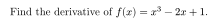
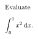
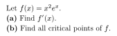

# Typst Authoring

Question bodies use Typst markup. You can mix plain prose and math in the same question.

For the full language reference, see Typst's official [Math documentation](https://typst.app/docs/reference/math/).

## Inline Math

Wrap inline math in single `$` signs with no surrounding spaces:

```typst
Find the derivative of $f(x) = x^3 - 2x + 1$.
```

Rendered:



## Display Math

Wrap display math in `$` signs with a space inside each end:

```typst
Evaluate $ integral_0^1 x^2 dif x. $
```

Rendered:



## Common Math Syntax

| Goal | Typst syntax |
|---|---|
| Fraction | `frac(a, b)` |
| Superscript | `x^2`, `e^(x+1)` |
| Subscript | `x_n`, `a_(i j)` |
| Square root | `sqrt(x)`, `root(3, x)` |
| Limit | `lim_(x -> 0)` |
| Integral | `integral_a^b f(x) dif x` |
| Sum | `sum_(n=1)^infinity` |
| Infinity | `infinity` |
| Greek letters | `alpha`, `beta`, `theta`, `pi`, `Delta` |
| Plus/minus | `plus.minus` |
| Implies | `=>` |
| Absolute value | `abs(x)` |
| Partial | `partial` |
| Prime | `f'(x)` |
| Bold text | `*bold*` |
| Italic text | `_italic_` |

## Multi-Part Questions

Use `#linebreak()` when writing parts directly:

```typst
Let $f(x) = x^2 e^x$. #linebreak()
*(a)* Find $f'(x)$. #linebreak()
*(b)* Find all critical points of $f$.
```

Rendered:



When importing LaTeX from exam-style sources, the importer converts `parts`, `subparts`, and `subsubparts` environments into nested Typst lists. The same conversion applies to solution blocks.

## Standalone `.typ` Caveat

Downloaded `.typ` files may reference `/imgs/<name>.<ext>` image paths that only exist in the app's IndexedDB-backed compiler environment. To compile one locally, copy the referenced images next to it and update paths as needed.
